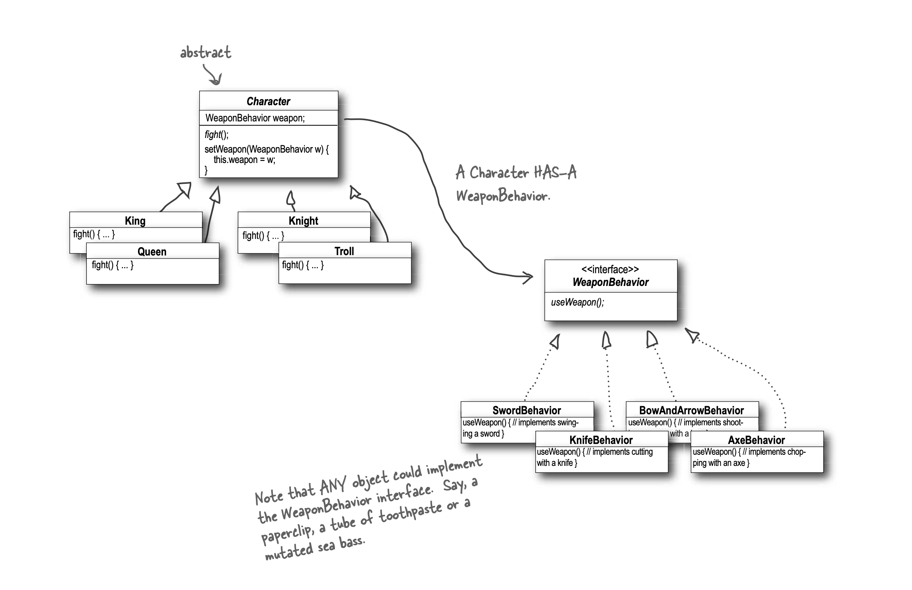

## Design Puzzle Solution

Character is the abstract class for all the other characters (King, Queen,
Knight and Troll) while Weapon is an interface that all weapons
implement. So all actual characters and weapons are concrete classes.
To switch weapons, each character calls the setWeapon() method, which
is defined in the Character superclass. During a fi ght the useWeapon()
method is called on the current weapon set for a given character to infl ict
great bodily damage on another character.

