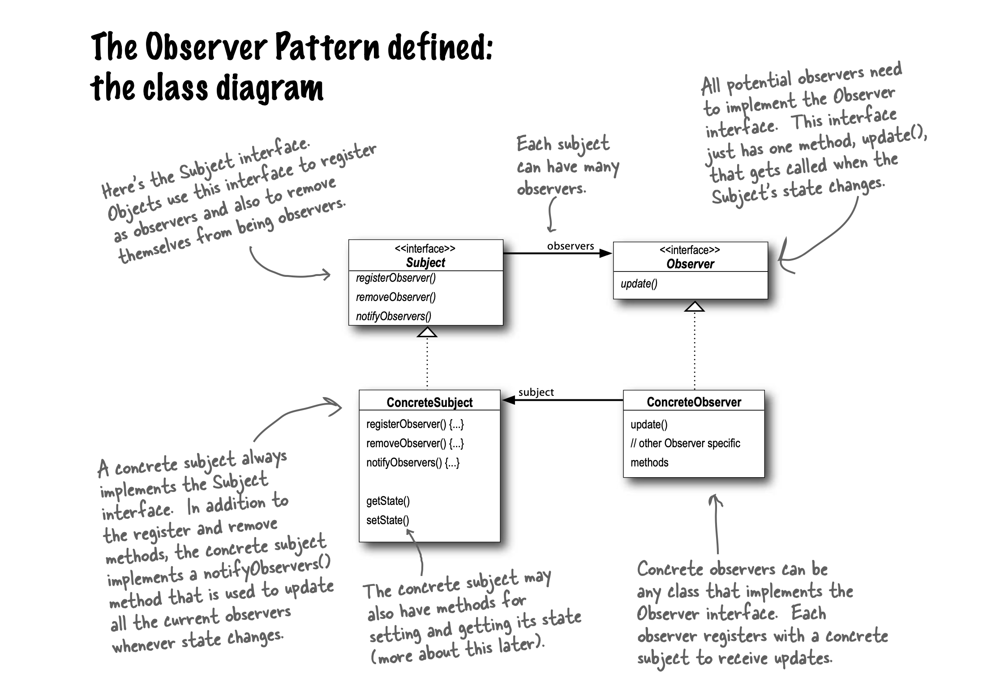

## Observer Pattern

> [!NOTE]
> Publishers + Subscribers = Observer Pattern

**The Observer Pattern** defines a one-to-many
dependency between objects so that when one
object changes state, all of its dependents are
notified and updated automatically.

#### The power of Loose Coupling
- When two objects are loosely coupled, they can interact,
but have very little knowledge of each other.
- The Observer Pattern provides an object design where
subjects and observers are loosely coupled.
  
**Why?**
- The only thing the subject knows about an observer is that it
  implements a certain interface.
- We can add new observers at any time.
- We never need to modify the subject to add new types of observers.
- We can reuse subjects or observers independently of each other.
- Changes to either the subject or an observer will not affect the other.

> [!IMPORTANT]
**Design Principle**\
Strive for loosely coupled designs
between objects that interact.