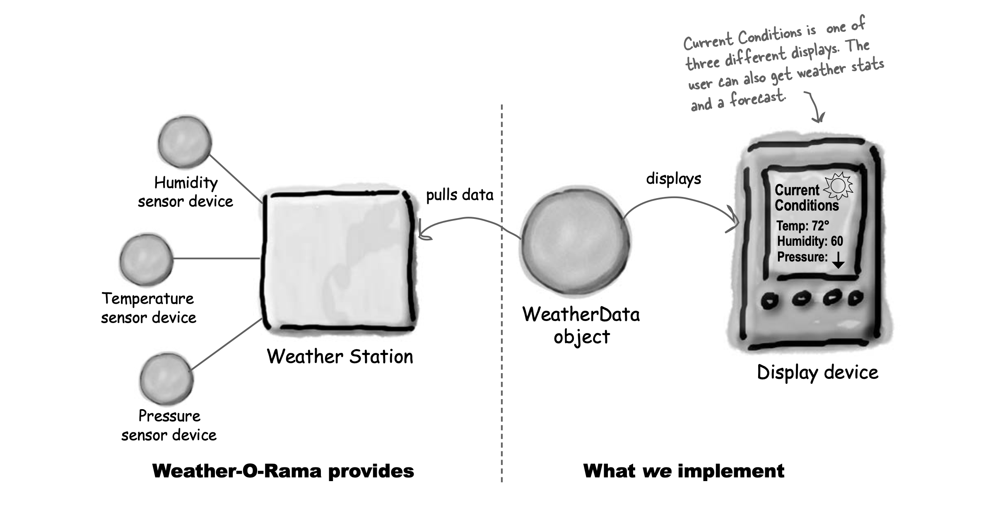

- The weather station will be based on our patent pending
  WeatherData object, which tracks current weather conditions
  -  temperature
  - humidity
  - barometric pressure
- Create an application that initially provides three
  display elements: 
  - current conditions
  - weather statistics 
  - simple forecast
- Weather-O-Rama wants to release an API so that other developers can
  write their own weather displays and plug them right in.

### The Weather Monitoring application overview
The three players in the system are: 
- **Weather station** (the physical device that
acquires the actual weather data)
- **WeatherData object** (that tracks the data coming
from the Weather Station and updates the displays) 
- the **display** that shows users
the current weather conditions.

- The WeatherData object knows how to talk to the physical Weather Station, to get
updated data. 
- The WeatherData object then updates its displays for the three different
display elements: 
  - Current Conditions (shows temperature, humidity, and pressure), 
  - Weather Statistics
  - Simple forecast