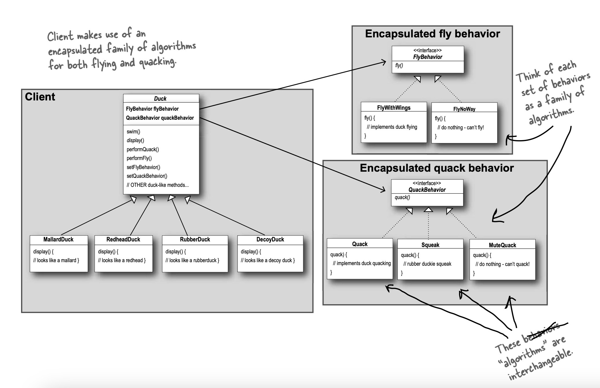

# Strategy Pattern
The Strategy Pattern defines a family of algorithms,
encapsulates each one, and makes them interchangeable.
Strategy lets the algorithm vary independently from
clients that use it.

**Design Principle**

- Identify the aspects of your
application that vary and separate
them from what stays the same.
- Program to an interface, not an
  implementation.
- Favor composition over inheritance.

>Take the parts
that vary and encapsulate them, so that later you can
alter or extend the parts that vary without affecting
those that don’t.

    
  In our example -
  We know that fly() and quack() are the parts of the
  Duck class that vary across ducks.
  To separate these behaviors from the Duck class, we’ll
  pull both methods out of the Duck class and create a
  new set of classes to represent each behavior.

  
  
